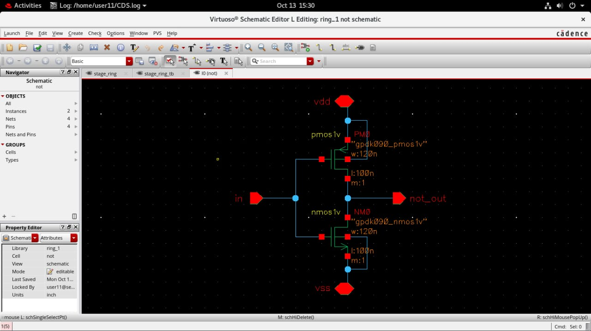
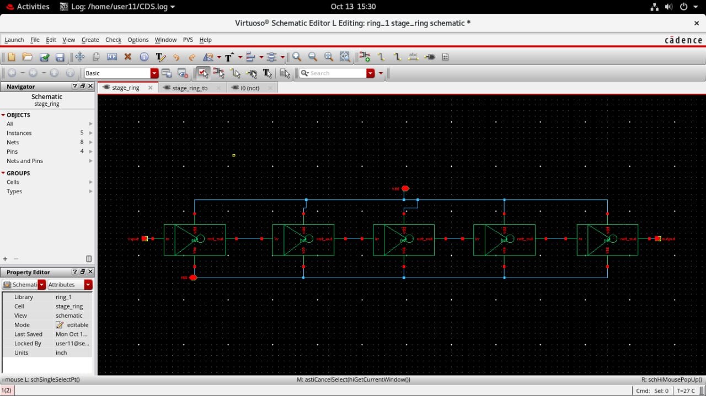
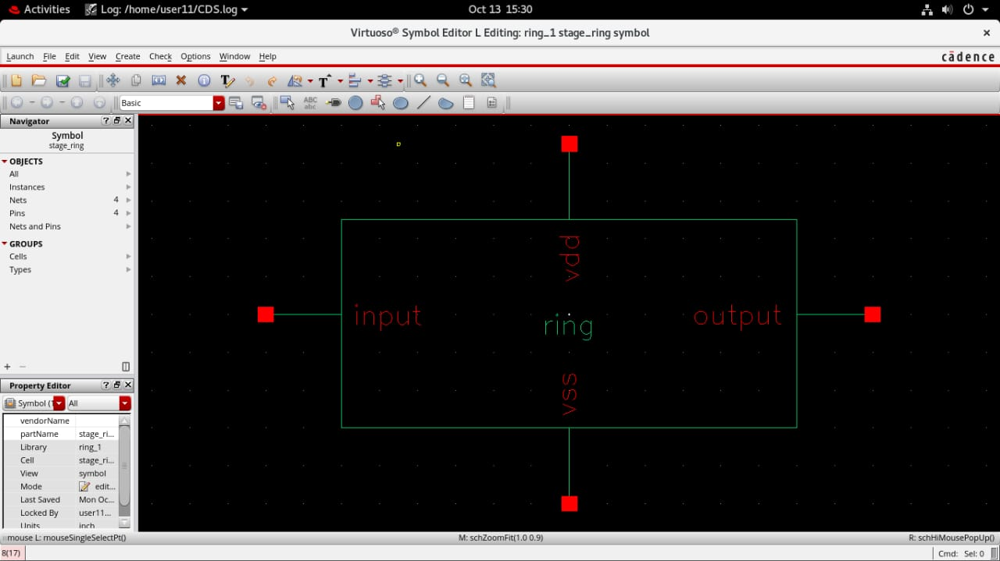
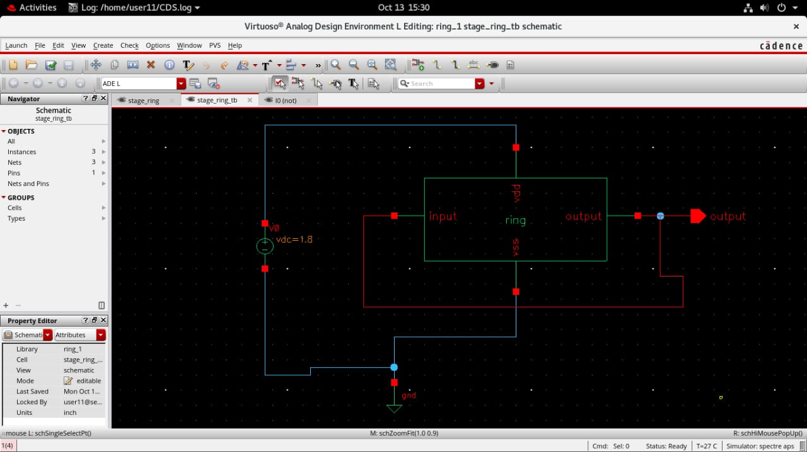
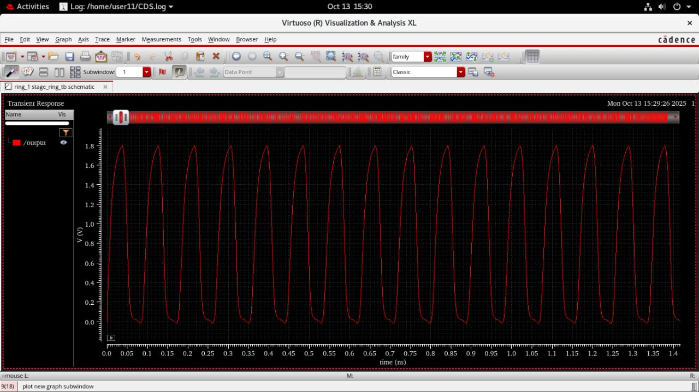

# 5-Stage Ring Oscillator - Cadence Virtuoso

This project demonstrates a 5-stage ring oscillator built using NOT gates in Cadence Virtuoso.

## Tools Used
- Cadence Virtuoso (Schematic & Simulation)
- CMOS 90nm Technology

## Description
- 5 NOT gates connected in a ring to generate oscillations.
- Simulated transient response shows expected oscillation frequency.

## Screenshots

